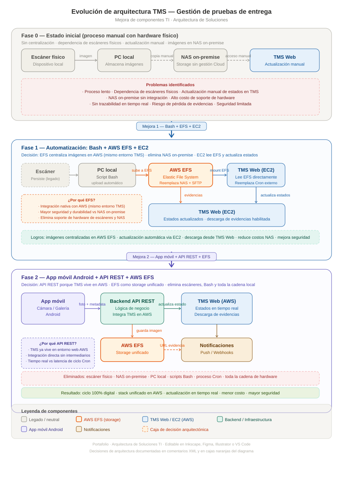

# Mejora de componentes en TMS — Gestión digital de pruebas de entrega

> **Arquitectura de Soluciones TI**  
> Migración progresiva desde procesos manuales con hardware físico hacia una arquitectura unificada en AWS, eliminando escáneres, NAS on-premise y procesos Bash.

---

## Descripción general

Este proyecto documenta la evolución arquitectónica del módulo de **pruebas de entrega** dentro de un Transportation Management System (TMS) alojado en AWS. El objetivo fue eliminar la dependencia de hardware físico, centralizar el almacenamiento de evidencias en la misma nube donde opera el TMS y automatizar la actualización de estados de guías.

| Fase | Estado | Tecnologías clave |
|------|--------|-------------------|
| Fase 0 | Proceso manual con escáneres y NAS on-premise | Escáner físico, PC local, NAS, TMS Web (AWS) |
| Fase 1 | Automatización con Bash + AWS EFS + EC2 | Script Bash, AWS EFS, EC2, TMS Web (AWS) |
| Fase 2 | Digitalización total con app móvil Android | Android, API REST, AWS EFS, TMS Web (AWS) |

---

## Diagrama de arquitectura



> El diagrama está en formato SVG editable. Puede abrirse y modificarse con Inkscape, Figma, Adobe Illustrator o cualquier editor de código. Las cajas naranjas en el diagrama documentan las decisiones arquitectónicas de cada fase.

---

## Contexto del problema

El proceso original de registro de pruebas de entrega dependía de:

- **Escáneres físicos** conectados a computadores locales de los operarios logísticos para escanear los documentos físicos de entrega.
- **PC local** como almacenamiento temporal de imágenes antes de cualquier centralización.
- **NAS on-premise** como repositorio de imágenes, sin integración con el entorno AWS donde opera el TMS.
- **Actualización manual** de estados de guías en el TMS Web por parte de un operador que accedía a la NAS y al sistema.

El TMS Web fue migrado a la nube de AWS, pero el ecosistema de captura de evidencias era completamente on-premise y desconectado, generando una brecha operacional y de seguridad significativa.

---

## Decisiones de arquitectura

### Fase 1 — Bash + AWS EFS + EC2

**Problema que resuelve:** las imágenes quedaban atrapadas en la NAS on-premise sin integración con AWS, y los estados se actualizaban manualmente.

#### ¿Por qué AWS EFS en lugar de mantener la NAS o usar un servidor SFTP?

El TMS Web se migró a la nube de AWS. Mantener una NAS on-premise como repositorio de evidencias implicaba:

- Un punto de integración externo costoso de mantener y asegurar.
- Gestión de hardware propio (backups, disponibilidad, actualizaciones).
- Menor seguridad frente a controles IAM nativos de AWS.
- Latencia y complejidad adicional para que los servicios AWS accedan a los archivos.

AWS EFS (Elastic File System) resuelve esto al ofrecer un sistema de archivos administrado, de alta disponibilidad y con integración nativa en la VPC de AWS donde vive el TMS. Los servicios EC2 montan EFS directamente, sin necesidad de protocolo SFTP ni infraestructura adicional. El resultado es menor costo total de operación y una postura de seguridad significativamente mejor.

#### ¿Por qué EC2 leyendo directamente de EFS en lugar de un Cron externo?

Dado que EFS está montado en la misma infraestructura AWS, el proceso en EC2 puede leer los archivos nuevos directamente sin necesidad de un proceso Cron independiente gestionado fuera del entorno. Esto simplifica la arquitectura, elimina una dependencia externa y consolida la lógica de actualización de estados en el mismo stack de AWS.

**Flujo resultante:**

```
Escáner → PC local + Script Bash → AWS EFS ← EC2 → TMS Web (AWS)
```

**Resultado:** imágenes centralizadas en AWS, actualización automática de estados, descarga de evidencias desde TMS Web, eliminación de NAS on-premise y reducción de costos operativos.

---

### Fase 2 — App móvil Android + API REST + AWS EFS

**Problema que resuelve:** el escáner físico y el PC local persisten como puntos de falla y dependencia de hardware. El script Bash es frágil y requiere mantenimiento.

#### ¿Por qué una app móvil Android con cámara?

Reemplazar el escáner físico por la cámara del dispositivo elimina hardware adicional, reduce costos de soporte y permite capturar la evidencia directamente en el punto de entrega sin pasos intermedios. Los escáner son tercerizados, por lo que se depende de un proveedor. Es mejor realizar una inversión en dispositivos móviles propios.

#### ¿Por qué API REST como mecanismo de integración?

El TMS ya es una aplicación web alojada en AWS. La API REST es la forma natural de integración con servicios web cloud: sin protocolos de archivo como SFTP, sin procesos de sincronización, sin latencia de ciclos de Cron. La app móvil envía la imagen y los metadatos en una sola llamada; el backend actualiza el estado en el TMS en tiempo real en la misma transacción.

#### ¿Por qué AWS EFS también en la Fase 2?

Mantener EFS como capa de almacenamiento de imágenes en la Fase 2 preserva el stack unificado en AWS establecido en la Fase 1. EFS sigue siendo el repositorio central de evidencias al que accede el TMS para servir las descargas, evitando introducir una nueva capa de almacenamiento y manteniendo la consistencia arquitectónica.

**Flujo resultante:**

```
App móvil (cámara) ──API REST──► Backend API ──► AWS EFS
                                      │
                                      └──► TMS Web (AWS) ──► Notificaciones
                                                │
                                           AWS EFS (URL evidencia)
```

**Componentes eliminados:**

- Escáner físico
- PC local como almacenamiento intermedio
- Scripts Bash de subida
- NAS on-premise
- Proceso Cron externo

**Resultado:** stack completamente unificado en AWS, actualización de estados en tiempo real, cero dependencia de hardware adicional y mayor postura de seguridad al operar todo dentro del perímetro AWS.

---

## Comparativa de arquitecturas

| Atributo | Fase 0 | Fase 1 | Fase 2 |
|----------|--------|--------|--------|
| Hardware requerido | Escáner + NAS | Escáner + PC | Solo smartphone |
| Almacenamiento | NAS on-premise | AWS EFS | AWS EFS |
| Integración con TMS (AWS) | Ninguna | EC2 lee EFS | API REST directa |
| Actualización de estados | Manual | Automática (EC2) | Tiempo real (API) |
| Disponibilidad de evidencias | No disponible | Descarga desde TMS | Descarga desde TMS |
| Seguridad | Baja (NAS sin IAM) | Alta (IAM + VPC) | Alta (IAM + VPC) |
| Resiliencia | Baja | Media-Alta | Alta |
| Escalabilidad | No escalable | Escalable en AWS | Cloud-native |

---

## Stack tecnológico

**Fase 1**
- Shell scripting (Bash) — automatización de subida de archivos
- AWS EFS (Elastic File System) — almacenamiento centralizado administrado
- AWS EC2 — proceso de lectura de EFS y actualización de estados en TMS

**Fase 2**
- App móvil Android (nativa o React Native / Flutter)
- API REST — integración con TMS Web en AWS
- AWS EFS — storage unificado de evidencias
- TMS Web en AWS — sistema de guías con estados en tiempo real
- Notificaciones push / Webhooks — alertas a actores del sistema

---

## Principios de arquitectura aplicados

- **Alineación con el entorno existente** — el TMS se migró a AWS, por lo que EFS y EC2 son la extensión natural del stack sin introducir nuevas plataformas.
- **Eliminación progresiva de deuda técnica** — cada fase elimina componentes frágiles (NAS, Bash, Cron, escáner) en lugar de acumularlos.
- **Justificación basada en costos y seguridad** — EFS frente a NAS on-premise reduce el costo total de propiedad y elimina la superficie de ataque de infraestructura propia.
- **Desacoplamiento de captura y procesamiento** — la app móvil solo captura y envía; el backend y EFS gestionan almacenamiento y lógica, facilitando cambios independientes.
- **Trazabilidad en tiempo real** — la API REST elimina la latencia inherente al ciclo Cron, entregando visibilidad inmediata del estado de cada guía.

---

## Lecciones aprendidas

La decisión más importante en este proyecto no fue tecnológica sino de alineación: al realizar la migración del TMS a AWS, quedó claro que la NAS on-premise era el mayor obstáculo arquitectónico, no los procesos manuales en sí. Resolver primero la capa de almacenamiento con EFS (Fase 1) creó las condiciones para que la Fase 2 fuera una evolución natural y no un rediseño completo.

La elección de API REST sobre cualquier mecanismo de sincronización de archivos en la Fase 2 responde a un principio simple: si el sistema destino es una aplicación web, la integración correcta es también web. Forzar una integración basada en archivos cuando existe una API disponible es acumular complejidad innecesaria.

---

## Autor

**Juan Esteban Peláez**  
Arquitecto de Soluciones TI  

---

*Arquitectura de soluciones TI — documentación técnica de proyectos reales con decisiones justificadas.*
