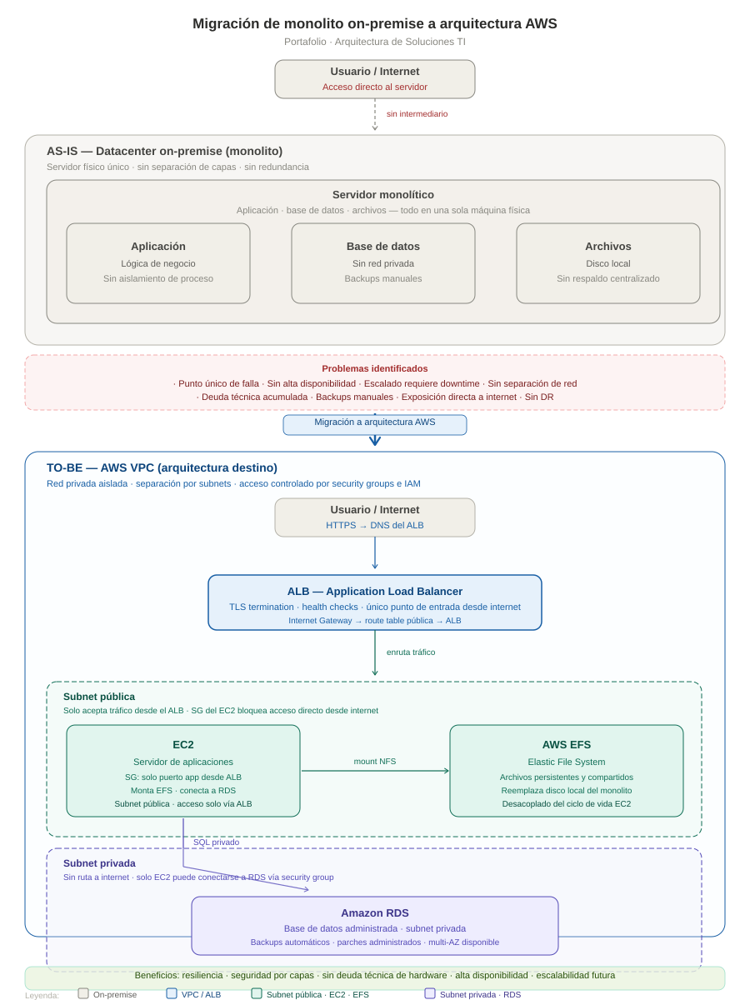

# Migración de monolito on-premise a arquitectura AWS

> **Arquitectura de Soluciones TI**
> Rediseño de infraestructura desde un servidor físico único en datacenter on-premise hacia una arquitectura AWS con separación de capas por subnets, acceso controlado por ALB y servicios administrados para base de datos y almacenamiento.

---

## Descripción general

Este caso documenta la migración de una aplicación que vivía como monolito en un servidor físico on-premise — con la aplicación, la base de datos y los archivos en la misma máquina — hacia una arquitectura AWS que separa cada responsabilidad en un componente independiente, administrado y con controles de red explícitos.

| Estado | Descripción | Stack |
|--------|-------------|-------|
| AS-IS | Monolito en datacenter on-premise | Servidor físico, disco local, acceso directo a internet |
| TO-BE | Arquitectura AWS con separación de capas | VPC, ALB, EC2, EFS, RDS |

---

## Diagrama de arquitectura

> El diagrama muestra el AS-IS y el TO-BE en flujo top-down. El usuario/internet aparece en la parte superior de cada sección para reflejar el punto de entrada real del tráfico. Editable con Inkscape, Figma, Illustrator o VS Code.

---

## Contexto del problema

El servidor on-premise concentraba todos los componentes de la aplicación en una sola máquina:

- La **aplicación**, la **base de datos** y los **archivos** corrían en el mismo sistema operativo sin aislamiento de proceso ni de red.
- Los usuarios accedían **directamente al servidor** desde internet, sin ningún intermediario que controlara el tráfico entrante.
- Los backups eran manuales y dependientes del equipo de operaciones.
- Cualquier actualización, escalado o falla afectaba la totalidad del sistema — no había forma de reemplazar un componente sin impactar los demás.

---

## Decisiones de arquitectura

### VPC con subnets pública y privada

**Decisión:** dividir la red en dos subnets con propósitos y exposición distintos.

La subnet pública tiene ruta a internet a través de una Internet Gateway. La subnet privada no tiene esa ruta — ningún tráfico externo puede llegar a ella directamente, por diseño de red y no solo por configuración de software.

Esta separación aplica el principio de mínimo privilegio a nivel de red: cada componente solo es accesible desde donde necesita serlo.

---

### ALB como único punto de entrada desde internet

**Decisión:** todo el tráfico externo entra por el ALB, nunca directamente al EC2.

El ALB vive en la subnet pública y es el único componente expuesto a internet. Hace TLS termination con un certificado que puede ser un ACM (AWS Certificate Manager) o un certificado externo (para el caso en particular se utilizó un TLS Wildcard). Realiza health checks sobre el EC2, y reenvía el tráfico al servidor de aplicaciones en HTTP interno.

El security group del EC2 solo acepta conexiones desde el security group del ALB — aunque el EC2 esté en la subnet pública, ningún usuario puede conectarse directamente a él. Este diseño desacopla la exposición pública del servidor de aplicaciones y sienta la base para agregar Auto Scaling en el futuro sin cambiar la arquitectura de red.

**¿Cómo llega el tráfico desde internet al ALB?**
El ALB recibe un DNS público al crearse (ej. `my-alb-123456.us-east-1.elb.amazonaws.com`). En Route 53 se crea un registro CNAME o Alias que apunta el dominio de la aplicación a ese DNS. El tráfico entra por la Internet Gateway, llega al ALB en la subnet pública, y desde ahí al EC2 de forma controlada. El dominio, para el caso específico, es un domonio externo (no de AWS).

---

### EC2 en subnet pública, protegido por security group

**Decisión:** el servidor de aplicaciones vive en la subnet pública pero su security group bloquea cualquier acceso que no venga del ALB.

Esto permite que el EC2 tenga salida a internet cuando necesita descargar dependencias o conectarse a servicios AWS, pero sin exponer ningún puerto directamente al exterior.

---

### Amazon RDS en subnet privada

**Decisión:** la base de datos vive en una subnet sin ruta a internet y solo es accesible desde el EC2.

Frente al monolito donde la base de datos estaba en la misma máquina y sin separación de red, RDS en subnet privada garantiza que ningún actor externo pueda intentar conectarse a ella directamente. El security group de RDS solo acepta conexiones desde el security group del EC2.

Adicionalmente, RDS elimina la gestión del motor de base de datos: backups automáticos configurables, parches del motor aplicados por AWS, y posibilidad de activar Multi-AZ para failover automático sin cambios en la aplicación.

---

### AWS EFS para archivos

**Decisión:** los archivos de la aplicación se almacenan en EFS en lugar de en el disco local del EC2.

En el monolito, los archivos vivían en el disco del servidor. Si el servidor fallaba o se reemplazaba, los archivos se perdían o quedaban inaccesibles. EFS es un sistema de archivos NFS administrado por AWS que se monta en el EC2 y persiste independientemente del ciclo de vida de la instancia. Si en el futuro se agrega un segundo EC2 (Auto Scaling), ambas instancias pueden montar el mismo EFS sin configuración adicional.

---

## Comparativa AS-IS vs TO-BE

| Atributo | AS-IS (monolito) | TO-BE (AWS) |
|----------|-----------------|-------------|
| Punto de entrada | Directo al servidor | ALB con TLS termination |
| Separación de red | Ninguna | Subnets pública y privada |
| Base de datos | Mismo servidor, sin red privada | RDS en subnet privada |
| Almacenamiento de archivos | Disco local | AWS EFS (persistente, compartido) |
| Backups | Manuales | Automáticos (RDS) |
| Alta disponibilidad | No | ALB + health checks + multi-AZ en RDS |
| Escalabilidad | Imposible sin downtime | Base para Auto Scaling Group |
| Seguridad | Exposición directa a internet | Capas: subnets + SG + IAM |
| Gestión de infraestructura | Manual (SO, parches, hardware) | Administrada por AWS (RDS, EFS) |

---

## Stack tecnológico

| Componente | Servicio AWS | Rol |
|------------|-------------|-----|
| Balanceador | ALB (Application Load Balancer) | Entrada única desde internet, TLS, health checks |
| Cómputo | EC2 | Servidor de aplicaciones |
| Almacenamiento archivos | AWS EFS | Sistema de archivos compartido y persistente |
| Base de datos | Amazon RDS | Motor administrado, subnet privada |
| Red | VPC + subnets + security groups | Aislamiento y control de tráfico |
| DNS | Route 53 + ACM | Resolución de dominio y certificado TLS |

---

## Principios de arquitectura aplicados

- **Mínimo privilegio en red** — cada componente solo es alcanzable desde donde necesita serlo; RDS nunca desde internet, EC2 solo desde el ALB.
- **Separación de responsabilidades** — app, base de datos y archivos son componentes independientes con ciclos de vida distintos.
- **Eliminación de deuda técnica** — servicios administrados (RDS, EFS) reemplazan la gestión manual de SO, parches y backups.
- **Resiliencia por diseño** — ningún componente es un punto único de falla; el ALB detecta fallos del EC2 y el RDS soporta failover automático.
- **Base para escalar** — la arquitectura soporta agregar Auto Scaling Group al EC2 sin rediseño de red ni de base de datos.

---

## Autor

**Juan Esteban Peláez**
Arquitecto de Soluciones TI

---

*Arquitectura de soluciones TI — Decisiones documentadas con justificación técnica y de negocio.*
